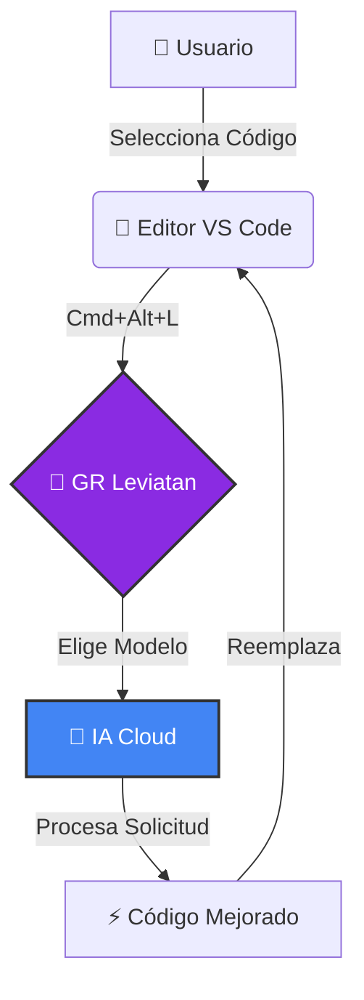
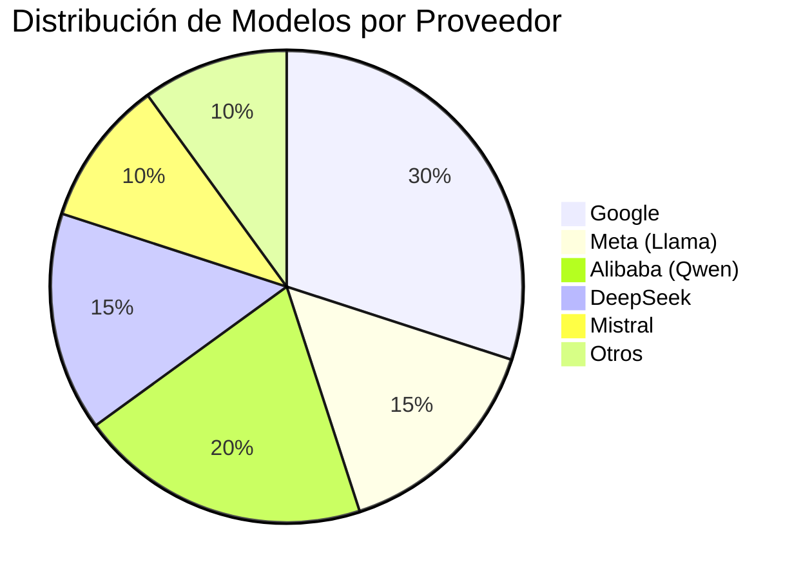
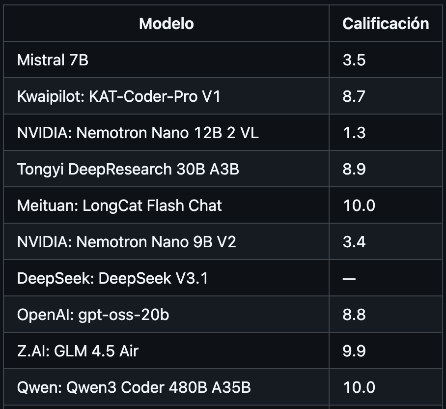

<table>
  <tr>
    <td width="150">
      
    </td>
    <td>
      <h1>GR Leviatan</h1>
      <em>“Tu Asistente de Codificación Impulsado por más de 40 modelos de IA”</em>
    </td>
  </tr>
</table>


## 💡 Sobre GR_Leviatan

**GR_Leviatan** es una **extensión privada para VS Code** que convierte tu flujo de trabajo en algo **rápido, intuitivo y potente**.
Gracias a **Google Gemini y Otros Modelos de IA**, puedes:

* Analizar y modificar **fragmentos o archivos completos** de código.
* Solicitar **refactorizaciones, optimizaciones o correcciones** en lenguaje natural.
* Colaborar en equipo con **clave API centralizada** y `.env`.

> ⚠️ **Nota:** Esta extensión es privada y solo funciona con la clave API proporcionada.

### 🔄 Flujo de Trabajo



---

## ✨ Características Destacadas

| ⚡ Funcionalidad                   | 📌 Detalle                                                             |
| --------------------------------- | ---------------------------------------------------------------------- |
| **Modificación Rápida**           | Refactoriza, optimiza o corrige errores con un solo comando.           |
| **Integración Total**             | Ejecuta cambios directamente desde VS Code sin abrir otra herramienta. |
| **Trabajo en Equipo**             | Todos usan la misma clave API, fácil de gestionar en `.env`.           |
| **Compatibilidad Multi-lenguaje** | `.js`, `.ts`, `.py`, `.cpp`, `.cs` y más.                              |
| **Control Total**                 | Selecciona fragmentos o envía todo el archivo al mismo tiempo.         |

---

## 🎨 Badges & Estado


---

## ⚙️ Instalación y Configuración

> 💡 **Tip:** Haz esto en un entorno limpio de VS Code para evitar conflictos.

### 1️⃣ Clonar el Repositorio

```bash
git clone https://github.com/grcodedigitalsolutions/GR_Leviatan.git
cd GR_Leviatan
```

### 2️⃣ Instalar Dependencias

```bash
npm install
```

---

### 3️⃣ Configurar la Clave API

Para que **GR_Leviatan** funcione correctamente necesitas crear **tus propias claves API**.
Las claves del **2 al 5** son **opcionales** y deben provenir de cuentas diferentes en **OpenRouter**.

---

| Servicio            | Badge                                                                                                          | Pasos para generar la API                                                                                                                                                                                                                                                        |
| ------------------- | -------------------------------------------------------------------------------------------------------------- | -------------------------------------------------------------------------------------------------------------------------------------------------------------------------------------------------------------------------------------------------------------------------------- |
| **Gemini (Google)** |  | 1. Ve a <a href="https://console.cloud.google.com/">Google Cloud Console</a>.<br>2. Crea un proyecto nuevo o selecciona uno existente.<br>3. Habilita el API de <b>Gemini (Google GenAI)</b>.                                                                                    |
| **OpenRouter**      |                                      | 1. Ve a <a href="https://openrouter.ai/settings/keys">OpenRouter / Keys</a>.<br>2. Inicia sesión o crea una cuenta nueva.<br>3. Genera tus claves API (puedes generar varias desde cuentas diferentes).<br><b>Nota:</b> Las claves 2 al 6 son opcionales y sirven como respaldo. |

---

### Tu `.env` debera quedar de este modo

```text
GEMINI_API_KEY="TU_API_KEY_DE_GEMINI"

API_KEY_1="API_KEY_DE_OPENROUTER"
API_KEY_2="API_KEY_OPCIONAL_CUENTA2"
API_KEY_3="API_KEY_OPCIONAL_CUENTA3"
API_KEY_4="API_KEY_OPCIONAL_CUENTA4"
API_KEY_5="API_KEY_OPCIONAL_CUENTA5"
API_KEY_6="API_KEY_OPCIONAL_CUENTA6"
````

# 🧠 Modelos Disponibles 



<details>
<summary><strong>👇 Ver Lista Completa de Modelos Soportados</strong></summary>
<br>

---
<table align="center" border="0" cellpadding="0" cellspacing="0">
  <tr>
    <td valign="middle">
      
    </td>
    <td valign="middle" style="padding-left: 8px; font-weight: 900; font-size: 24px;">
      Google Gemini — Modelo Principal
    </td>
  </tr>
</table>


<div align="center">

  <!-- GIF con marco con degradado -->
  <div style="
    display: inline-block;
    padding: 8px;
    border-radius: 20px;
    background: linear-gradient(90deg, #3da7f7, #b96dff, #ff2f4b);
  ">
    
  </div>

  <br><br>

  <!-- Badge con ícono customizado -->  
  


  <p style="
    font-size: 18px; 
    color: #e7d3ff; 
    margin-top: 18px;
  ">
    Motor de IA principal basado en <b>Gemini 2.5 Flash</b> — <b>Google DeepMind</b>
  </p>

</div>


---

## 🔵 Google

[](#)  
[](#)  
[](#)  
[](#)  
[](#)  
[](#)

---

## 🟣 Meta – Llama

[](#)
[](#)
[](#)
[](#)

---

## 🟥 Alibaba – Qwen

[](#)
[](#)
[](#)
[](#)
[](#)
[](#)
[](#)
[](#)

---

## 🟨 DeepSeek

[](#)
[](#)
[](#)
[](#)
[](#)
[](#)
[](#)

---

## 🔵 Mistral

[](#)
[](#)
[](#)
[](#)
[](#)

---

## 🟩 NVIDIA

[](#)
[](#)

---

## 🟫 Microsoft

[](#)

---

## 🟧 TNG Tech

[](#)
[](#)

---

## 🟦 Z-AI

[](#)

---

## 🟧 Kwaipilot

[](#)

---

## 🟨 Meituan

[](#)

---

## 🟦 OpenAI OSS

[](#)

---

## 🟫 Venice / Cognitive Computations

[](#)

---

## 🟩 ArliAI

[](#)

---

---

## 🟥 Alibaba – Tongyi

[](#)

---

</details>

## 🚀 Tabla de Clasificación por Modelo (Click para ver completa)

[](assets/calificacion.md)

---

###   Ejecutar en VS Code

```text
1. Abre el proyecto.
2. Presiona `F5` o ve a **Run → Start Debugging**.
3. Se abrirá una **nueva ventana** de VS Code en **modo desarrollo de extensión**.
````

---

## 🚀 Cómo Usar GR_Leviatan

### ⌨️ Atajo Rápido
**`Cmd + Alt + L`** (Mac) o **`Ctrl + Alt + L`** (Windows/Linux)

### 📝 Pasos
1. **Abre un archivo** de código (`.js`, `.ts`, `.py`, etc.).
2. **Selecciona el código** que quieres modificar.
   > *Si no seleccionas nada, se enviará todo el archivo.*
3. Presiona el atajo **`Cmd + Alt + L`** o usa `F1` y busca **"GR Leviatan: Modificar Código"**.
4. **Elige un modelo** de la lista (Gemini, Mistral, Llama, etc.).
5. **Escribe tu instrucción** en el cuadro de texto.
   * Ej: *"Refactoriza esto para usar async/await"*
   * Ej: *"Añade comentarios explicativos"*
6. ¡Listo! La IA aplicará los cambios automáticamente.

---

## 🛠️ Solución de Problemas

### ❌ Error: "Todas las claves de API fallaron"
* Verifica que tu archivo `.env` esté en la raíz del proyecto.
* Asegúrate de que las claves API en `.env` sean válidas y tengan crédito (si aplica).
* Revisa tu conexión a internet.

### ❌ El modelo no devuelve nada
* Algunos modelos gratuitos pueden estar saturados. Intenta con otro modelo de la lista.
* Intenta simplificar tu solicitud o seleccionar un fragmento de código más pequeño.

## 📚 Tips Avanzados

> 💡 **Tip de Productividad:**
> Combina GR_Leviatan con snippets de VS Code para acelerar aún más tus refactorizaciones.


---

## 📂 Estructura del Proyecto

```text
GR_LEVIATAN/
├─ .github/        # Archivos de configuración de GitHub
│  ├─ ISSUE_TEMPLATE
│  ├─ FUNDING.yml      # Configuración de financiación
│  └─ PULL_REQUEST_TEMPLATE.md
├─ assets/         # Archivos de recursos (imágenes, calificaciones)
│  ├─ calificacion.md
│  ├─ Leviatan.png
│  └─ tabla_preview.png
├─ docs/           # Documentación y licencias traducidas
│  ├─ LICENCE_DE
│  ├─ LICENCE_EN
│  ├─ LICENCE_ES
│  ├─ LICENCE_FR
│  └─ LICENCE_PT
├─ node_modules/   # Dependencias de Node.js
├─ out/            # Salida de la compilación (e.g., extension.js)
├─ src/            # Código fuente principal
│  └─ extension.ts
├─ .env            # Variables de entorno compartidas (e.g., clave API)
├─ .gitignore      # Archivo para ignorar en Git
├─ LICENCE         # Licencia principal del proyecto
├─ package-lock.json # Bloqueo de dependencias
├─ package.json    # Metadatos y scripts del proyecto
├─ README.md       # Este archivo
└─ tsconfig.json   # Configuración de TypeScript
```

---

## 💌 Contribuciones y README

```bash
git add README.md
git commit -m "docs: Añadir README ultra llamativo"
git push origin main
```

> 🙌 Siempre mantén tu README actualizado para el equipo.

---

## 📎 Recursos

* [VS Code Marketplace](https://marketplace.visualstudio.com/)
* [Documentación Node.js](https://nodejs.org/en/docs/)
* [Google Gemini AI](https://developers.google.com/)

---

## 🏆 Créditos

**GR Code Digital Solutions** – Equipo de desarrollo y mantenimiento.
💻 Creado para hacer que cada línea de código cuente.

---

## 💙 Apoya El Proyecto
<center>
Si este proyecto te ha sido útil, considera apoyarlo a través de **GitHub Sponsors**.  
Tu contribución ayuda a mantener el desarrollo activo y mejorar futuras versiones.

</center>

---

<div align="center">

  

  <p style="font-size: 22px; font-weight: 800; margin: 0;">
    JoseEduardoGR
  </p>

  <p>
    <strong>Desarrollador • Python • C++ • Node</strong><br/>
    🚀 Avanza aunque duela, cada salto te acerca a la versión que nadie creía posible.
  </p>

  <p>
    <a href="https://github.com/JoseEduardoGR?tab=followers">
      ⭐ Seguir en GitHub
    </a>
  </p>

  <a href="https://github.com/sponsors/JoseEduardoGR">
    
  </a>

</div>

---

## 📄 Licencia

Esta obra está protegida por una **Licencia Personalizada Privada**  
*(inspirada en la Business Source License 1.1)*

Puedes consultar las versiones disponibles en su **idioma respectivo**:

- [Español](docs/LICENCE_ES)  
- [English](docs/LICENCE_EN)  
- [Deutsch](docs/LICENCE_DE)  
- [Français](docs/LICENCE_FR)  
- [Português](docs/LICENCE_TP) 

---